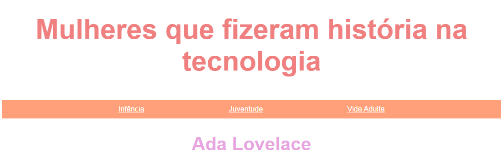

# Site da Ada Lovelace

### Projeto desenvolvido para o *curso online eu progr{amo}* do **Programaria**.

&nbsp;

No curso, que é uma introdução à programação com foco em desenvolvimento web, foram abordados os conceitos iniciais em HTML, CSS e JavaScript.

&nbsp;

Clique na imagem para visualizar o site:

